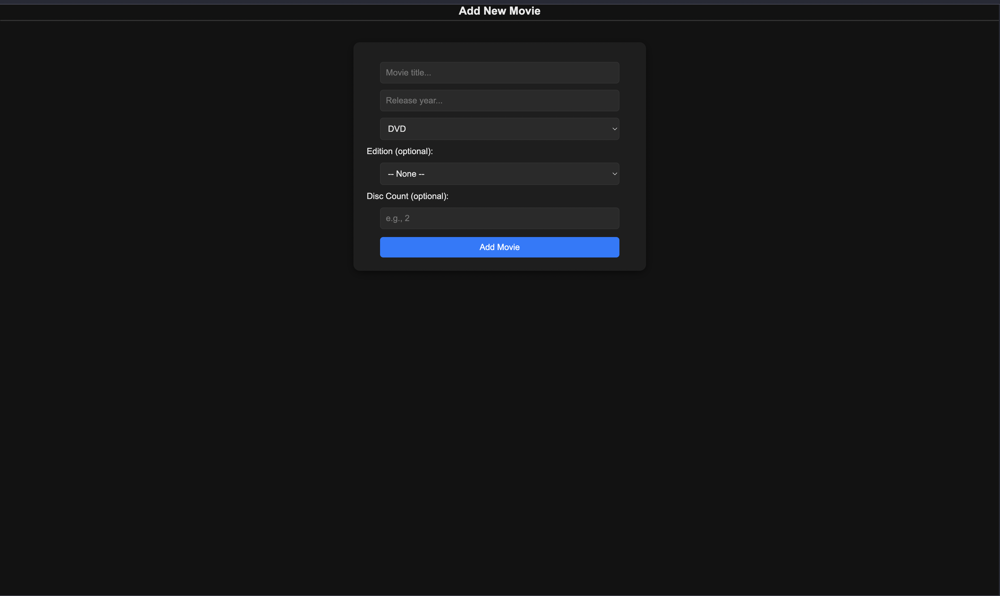
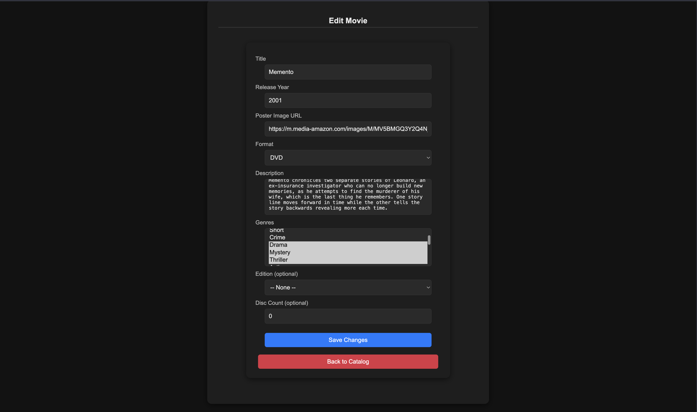
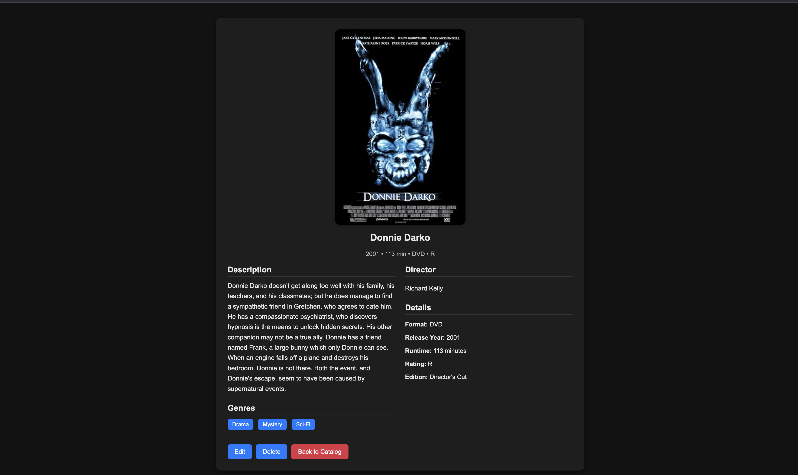

# MovieCatalog

As I got more into physical media I started collecting DVDs, and would thrift a lot. As my collection grew, I'd come across movies with different editions, or titles I thought I didn't own yet, and end up buying duplicates. So I built this project using Servlets, JSP, and JDBC to understand what abstractions Spring Boot makes, and to have something that actually tracks what I own.

Throughout this project  I learned how Servlets work, how to structure a Java web app manually, and how to connect to and consume external APIs.

I can search for a movie via the OMDb API, view its details, and save it to my personal catalog, backed by PostgreSQL, so I know what I already have before buying it again.

## Screenshots

| Add Movie | Edit Movie |
|---|---|
|  |  |

| Collection View | Movie Details  |
|---|---|
|  |  |

## Features

- Search — query the [OMDb API](https://www.omdbapi.com/) by title, or by title and release year for more precise results
- Multiple results handling — differentiate movie results when a search matches more than one title
- Movie details — view full info for a selected movie
- Add to catalog — save a movie to my personal collection (PostgreSQL)
- Edit — update saved entries
- Collection view — browse everything I've saved, so I know what I own before I buy it again

## Tech Stack

| Layer | Technology |
|---|---|
| Language | Java |
| Web layer | Servlets + JSP (JSTL) |
| Architecture | Manually implemented MVC (no framework) |
| Database access | JDBC (PostgreSQL) |
| Config/secrets | JNDI (datasource config kept out of source) |
| External data | OMDb API (via HTTP client + Jackson for JSON parsing) |
| API testing | REST Assured |
| Build | Maven |
| Deployment | Packaged as a WAR, deployed to Apache Tomcat |

## Architecture

This project follows a manual MVC pattern:

- **Controller:** Servlets
- **View:** JSP + JSTL
- **Model:** Movie POJO
- **Persistence:** JDBC DAO layer
- **External API:** OMDb API client

A typical request flow: a request hits a Servlet → the Servlet calls either the OMDb API client (for search/details) or a DAO (for saved catalog data) → the result is placed into the request scope → the Servlet forwards to a JSP → the JSP renders the response.

## What I Learned / Practiced

- Servlets — how they handle requests and responses, and how to route manually
- Manual MVC — structuring a Java web app without a framework
- Hand-written JDBC — connections, prepared statements, and a DAO layer built from scratch
- JNDI configuration — server-side secrets management instead of hardcoded credentials
- WAR deployment — packaging and deploying a Java web app to Tomcat
- External API integration — connecting to OMDb and parsing JSON responses with Jackson
- API testing — wrote automated tests for the OMDb integration using REST Assured

## How to Run

**Prerequisites:** Java, Maven, Apache Tomcat, PostgreSQL, and an [OMDb API key](https://www.omdbapi.com/apikey.aspx)

1. Clone the repo:
   ```bash
   git clone https://github.com/AkyroWoods/moviecatalog.git
   ```
2. Create a PostgreSQL database, then configure a JNDI datasource (in Tomcat's `context.xml`) with your database credentials and OMDb API key.
3. Build the WAR:
   ```bash
   mvn clean package
   ```
4. Deploy the generated `.war` file from `target/` into Tomcat's `webapps/` directory.
5. Start Tomcat and visit `http://localhost:8080/moviecatalog` (adjust the port and context path if yours differ).

---
